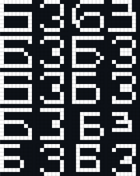

# This repository contains labs discipline "Image recognition systems"

## Contents

1. [LABORATORY WORK №1](#laboratory-work-1) \
   1.1. [INITIAL DATA](#11-initial-data)  
   1.2. [TEST SAMPLE](#TS)  
   1.3. [RESULTS](#RES)
2. [LABORATORY WORK №2](#LW2) \
   2.1. [INITIAL DATA](#ID)  
   2.2. [PROGRESS](#PR)  
   2.3. [RESULTS](#RES)
3. [LABORATORY WORK №3](#LW3) \
   3.1. [INITIAL DATA](#ID)  
   3.2. [OPERATION OF THE ALGORITHM](#OPALG)  
   3.3. [RESULTS](#RES)
4. [LABORATORY WORK №4](#LW4)  
   4.1. [INITIAL DATA](#ID)  
   4.2. [PROGRESS](#PR)  
   4.3. [RESULTS](#RES)

## LABORATORY WORK №1

**"Statistical recognition. Bayesian classification"**  
Write a program and solve a similar Bayesian classification problem. Assess recognition accuracy.

### 1.1. INITIAL DATA

Let there be a training set of letters "B" and "Z", given in Capture 1. Each object is represented as an 8×8 black and
white image.

Picture 1. Training set

The features are the average sizes of 2 × 2 image fragments (Picture 2), i.e. the feature vector has the form:
x = (x₁, x₂, x₃, x₄, x₅, x₆, x₇, x₈, x₉, x₁₀, x₁₁, x₁₂, x₁₃, x₁₄, x₁₅, x₁₆).

<!DOCTYPE html>
<html lang="en">
<head>
  
</head>
<body>
  <table>
    <tbody>
      <tr>
        <td></td>
        <td></td>
        <td></td>
        <td></td>
        <td></td>
        <td></td>
        <td></td>
        <td></td>
      </tr>
      <tr>
        <td></td>
        <td></td>
        <td></td>
        <td></td>
        <td></td>
        <td></td>
        <td></td>
        <td></td>
      </tr>
      <tr>
        <td></td>
        <td></td>
        <td></td>
        <td></td>
        <td></td>
        <td></td>
        <td></td>
        <td></td>
      </tr>
      <tr>
        <td></td>
        <td></td>
        <td></td>
        <td></td>
        <td></td>
        <td></td>
        <td></td>
        <td></td>
      </tr>
      <tr>
        <td></td>
        <td></td>
        <td></td>
        <td></td>
        <td></td>
        <td></td>
        <td></td>
        <td></td>
      </tr>
      <tr>
        <td></td>
        <td></td>
        <td></td>
        <td></td>
        <td></td>
        <td></td>
        <td></td>
        <td></td>
      </tr>
      <tr>
        <td></td>
        <td></td>
        <td></td>
        <td></td>
        <td></td>
        <td></td>
        <td></td>
        <td></td>
      </tr>
      <tr>
        <td></td>
        <td></td>
        <td></td>
        <td></td>
        <td></td>
        <td></td>
        <td></td>
        <td></td>
      </tr>
      <!-- Repeat the above row for each row in the table -->
    </tbody>
  </table>
</body>
</html>

