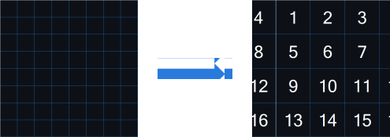
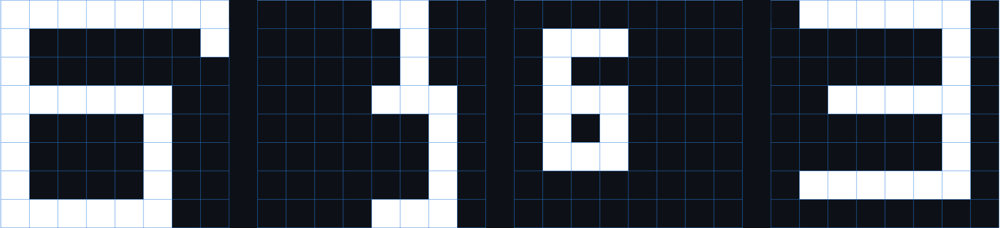

# This repository contains labs discipline "Image recognition systems"

## Contents

1. [LABORATORY WORK №1](#laboratory-work-1) \
   1.1. [INITIAL DATA](#11-initial-data)  
   1.2. [TEST SAMPLE](#12-test-sample)  
   1.3. [RESULTS](#RES)
2. [LABORATORY WORK №2](#LW2) \
   2.1. [INITIAL DATA](#ID)  
   2.2. [PROGRESS](#PR)  
   2.3. [RESULTS](#RES)
3. [LABORATORY WORK №3](#LW3) \
   3.1. [INITIAL DATA](#ID)  
   3.2. [OPERATION OF THE ALGORITHM](#OPALG)  
   3.3. [RESULTS](#RES)
4. [LABORATORY WORK №4](#LW4)  
   4.1. [INITIAL DATA](#ID)  
   4.2. [PROGRESS](#PR)  
   4.3. [RESULTS](#RES)

## LABORATORY WORK №1

**"Statistical recognition. Bayesian classification"**  
Write a program and solve a similar Bayesian classification problem. Assess recognition accuracy.

### 1.1. INITIAL DATA

Let there be a training set of letters "B" and "Z", given in Capture 1. Each object is represented as an 8×8 black and
white image.

<div align="center">

  

Picture 1. Training set
</div>

<br>

The features are the average sizes of 2 × 2 image fragments (Picture 2), i.e. the feature vector has the form:
x = (x₁, x₂, x₃, x₄, x₅, x₆, x₇, x₈, x₉, x₁₀, x₁₁, x₁₂, x₁₃, x₁₄, x₁₅, x₁₆).

<div align="center">



Picture 2. Formation of signs
</div>

<br>

The training sample contains the following data:

```
static int[] b1 = {3, 2, 2, 2, 3, 2, 2, 2, 2, 0, 0, 2, 3, 2, 2, 3};
static int[] b2 = {3, 2, 2, 2, 3, 2, 2, 0, 2, 0, 0, 2, 3, 2, 2, 3};
static int[] b3 = {3, 2, 2, 3, 3, 2, 2, 2, 2, 0, 0, 2, 3, 2, 2, 3};
static int[] b4 = {3, 2, 2, 2, 3, 2, 2, 0, 2, 0, 0, 2, 3, 2, 2, 3};
static int[] b5 = {3, 2, 1, 0, 3, 2, 1, 0, 2, 0, 2, 0, 2, 2, 1, 0};
static int[] b6 = {1, 2, 2, 2, 2, 1, 2, 1, 3, 1, 0, 2, 1, 2, 2, 2};
static int[] b7 = {3, 2, 2, 2, 3, 2, 2, 0, 2, 0, 0, 2, 3, 2, 2, 1};
static int[] b8 = {3, 2, 2, 0, 3, 2, 2, 0, 2, 0, 0, 2, 3, 2, 2, 1};
static int[] b9 = {0, 2, 2, 1, 0, 2, 0, 0, 0, 3, 2, 2, 0, 3, 2, 2};
static int[] b10 = {2, 2, 2, 2, 2, 2, 2, 0, 2, 0, 0, 2, 1, 2, 2, 1};

static int[] z1 = {1, 2, 2, 1, 0, 0, 0, 2, 0, 0, 2, 1, 1, 2, 2, 1};
static int[] z2 = {1, 2, 2, 1, 0, 0, 2, 1, 0, 0, 2, 1, 1, 2, 2, 1};
static int[] z3 = {1, 2, 2, 2, 0, 0, 2, 1, 0, 0, 2, 1, 1, 2, 2, 2};
static int[] z4 = {1, 2, 2, 2, 0, 0, 2, 1, 0, 0, 2, 1, 1, 2, 2, 2};
static int[] z5 = {1, 2, 2, 1, 0, 1, 2, 1, 0, 0, 0, 2, 1, 2, 2, 1};
static int[] z6 = {1, 2, 3, 0, 1, 2, 3, 1, 0, 0, 0, 2, 2, 2, 2, 2};
static int[] z7 = {1, 2, 2, 1, 0, 1, 2, 1, 0, 1, 2, 1, 1, 2, 2, 1};
static int[] z8 = {2, 2, 2, 1, 0, 1, 2, 1, 0, 1, 2, 1, 2, 2, 2, 1};
static int[] z9 = {1, 2, 1, 0, 0, 2, 3, 0, 1, 2, 3, 0, 0, 0, 0, 0};
static int[] z10 = {1, 2, 2, 2, 0, 0, 2, 1, 0, 1, 2, 1, 1, 2, 2, 2};
```

### 1.2. TEST SAMPLE

<div align="center">



Picture 3. Test sample
</div>

<br>

We chose 4 images, based on them, we will check the operation of the program.
```
Y₁ = (3, 2, 2, 3, 3, 2, 2, 0, 2, 0, 2, 0, 3, 2, 3, 0);
Y₂ = (0, 0, 3, 0, 0, 0, 3, 1, 0, 0, 0, 2, 0, 0, 2, 2);
Y₃ = (1, 2, 0, 0, 2, 2, 0, 0, 2, 3, 0, 0, 0, 0, 0, 0);
Y₄ = (1, 2, 2, 2, 0, 2, 2, 2, 0, 0, 0, 2, 1, 2, 2, 1).
```