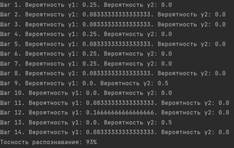

# This repository contains labs discipline "Image recognition systems"

## Contents

1. [LABORATORY WORK №1](#laboratory-work-1) \
   1.1. [INITIAL DATA](#11-initial-data)  
   1.2. [TEST SAMPLE](#12-test-sample)  
   1.3. [RESULTS](#13-results)
2. [LABORATORY WORK №2](#laboratory-work-2) \
   2.1. [INITIAL DATA](#21-initial-data)  
   2.2. [PROGRESS](#22-progress)
3. [LABORATORY WORK №3](#laboratory-work-3) \
   3.1. [INITIAL DATA](#31-initial-data)  
   3.2. [OPERATION OF THE ALGORITHM](#32-operation-of-the-algorithm)  
   3.3. [RESULTS](#33-results)
4. [LABORATORY WORK №4](#LW4)  
   4.1. [INITIAL DATA](#ID)  
   4.2. [PROGRESS](#PR)  
   4.3. [RESULTS](#RES)

## LABORATORY WORK №1

**"Statistical recognition. Bayesian classification"**  

Write a program and solve a similar Bayesian classification problem. Assess recognition accuracy.

### 1.1. INITIAL DATA

Let there be a training set of letters "Б" and "З", given in Picture 1.1.1. Each object is represented as an 8×8 black and
white image.

<div align="center">

  

Picture 1.1.1. Training set
</div>

<br>

The features are the average sizes of 2 × 2 image fragments (Picture 1.1.2), i.e. the feature vector has the form:
x = (x₁, x₂, x₃, x₄, x₅, x₆, x₇, x₈, x₉, x₁₀, x₁₁, x₁₂, x₁₃, x₁₄, x₁₅, x₁₆).

<div align="center">


Picture 1.1.2. Formation of signs
</div>

<br>

The training sample contains the following data:

```
static int[] b1 = {3, 2, 2, 2, 3, 2, 2, 2, 2, 0, 0, 2, 3, 2, 2, 3};
static int[] b2 = {3, 2, 2, 2, 3, 2, 2, 0, 2, 0, 0, 2, 3, 2, 2, 3};
static int[] b3 = {3, 2, 2, 3, 3, 2, 2, 2, 2, 0, 0, 2, 3, 2, 2, 3};
static int[] b4 = {3, 2, 2, 2, 3, 2, 2, 0, 2, 0, 0, 2, 3, 2, 2, 3};
static int[] b5 = {3, 2, 1, 0, 3, 2, 1, 0, 2, 0, 2, 0, 2, 2, 1, 0};
static int[] b6 = {1, 2, 2, 2, 2, 1, 2, 1, 3, 1, 0, 2, 1, 2, 2, 2};
static int[] b7 = {3, 2, 2, 2, 3, 2, 2, 0, 2, 0, 0, 2, 3, 2, 2, 1};
static int[] b8 = {3, 2, 2, 0, 3, 2, 2, 0, 2, 0, 0, 2, 3, 2, 2, 1};
static int[] b9 = {0, 2, 2, 1, 0, 2, 0, 0, 0, 3, 2, 2, 0, 3, 2, 2};
static int[] b10 = {2, 2, 2, 2, 2, 2, 2, 0, 2, 0, 0, 2, 1, 2, 2, 1};

static int[] z1 = {1, 2, 2, 1, 0, 0, 0, 2, 0, 0, 2, 1, 1, 2, 2, 1};
static int[] z2 = {1, 2, 2, 1, 0, 0, 2, 1, 0, 0, 2, 1, 1, 2, 2, 1};
static int[] z3 = {1, 2, 2, 2, 0, 0, 2, 1, 0, 0, 2, 1, 1, 2, 2, 2};
static int[] z4 = {1, 2, 2, 2, 0, 0, 2, 1, 0, 0, 2, 1, 1, 2, 2, 2};
static int[] z5 = {1, 2, 2, 1, 0, 1, 2, 1, 0, 0, 0, 2, 1, 2, 2, 1};
static int[] z6 = {1, 2, 3, 0, 1, 2, 3, 1, 0, 0, 0, 2, 2, 2, 2, 2};
static int[] z7 = {1, 2, 2, 1, 0, 1, 2, 1, 0, 1, 2, 1, 1, 2, 2, 1};
static int[] z8 = {2, 2, 2, 1, 0, 1, 2, 1, 0, 1, 2, 1, 2, 2, 2, 1};
static int[] z9 = {1, 2, 1, 0, 0, 2, 3, 0, 1, 2, 3, 0, 0, 0, 0, 0};
static int[] z10 = {1, 2, 2, 2, 0, 0, 2, 1, 0, 1, 2, 1, 1, 2, 2, 2};
```

### 1.2. TEST SAMPLE

<div align="center">


Picture 1.2.1. Test sample
</div>

<br>

We chose 4 images, based on them, we will check the operation of the program.
```
Y₁ = (3, 2, 2, 3, 3, 2, 2, 0, 2, 0, 2, 0, 3, 2, 3, 0);
Y₂ = (0, 0, 3, 0, 0, 0, 3, 1, 0, 0, 0, 2, 0, 0, 2, 2);
Y₃ = (1, 2, 0, 0, 2, 2, 0, 0, 2, 3, 0, 0, 0, 0, 0, 0);
Y₄ = (1, 2, 2, 2, 0, 2, 2, 2, 0, 0, 0, 2, 1, 2, 2, 1).
```

### 1.3. RESULTS

The program was developed in the Java programming language using the IntelliJ IDEA development environment. Picture 1.3.1 shows the results of the program.

<div align="center">


Picture 1.3.1. The result of the program after 4 experiments
</div>

## LABORATORY WORK №2

**"Logical recognition. Dead End Test"**  

The task is to write a program and solve the recognition problem by calculating scores based on dead-end tests. Assess recognition accuracy.

### 2.1. INITIAL DATA

A training sample consisting of the following features:

```
private static final String[] AGE = {"Пожилой", "Средний", "Молодой"};
private static final String[] SEX = {"Мужской", "Женский"};
private static final String[] DISEASE_STAGE = {"Поздняя", "Начальная", "Средняя"};
private static final String[] SORE_SPOT = {"Голова", "Спина", "Живот", "Руки", "Ноги", "Отсутствует"};
private static final String[] TEMPERATURE = {"Пониженная", "Нормальная", "Незначительно повышенная", "Значительно повышенная"};
private static final String[] OTHER_SENSATIONS = {"Озноб", "Отсутствие аппетита", "Тошнота", "Отсутствуют"};
```

### 2.2. PROGRESS

Prepare a training sample of at least eight objects divided into two classes. Use as signs: age, gender, stage of the disease, sore spot, temperature, other sensations.  
To solve this problem, it was decided to write a small program that, for a specified number of patients, will select random feature values. The program code is part of the entire solution.  

The result of the code when the number of patients = 14 (Picture 2.2.1)

<div align="center">


Picture 2.2.1. Training set
</div>

<br>

Below is a comparison table (Picture 2.2.2). For each patient from the first class (y1), a patient from the second class (y2) is matched (paired) and their factors are compared. If the factors match, then the corresponding cell is filled with zero.

<div align="center">


Picture 2.2.2. Comparison table
</div>

<br>

Next, we define a list of dead-end tests (Picture 2.2.3.). To find them, we need to compare the columns of the comparison matrix in pairs. This can be done by generating combinations without repetitions 6 by 2. Then we cycle through each pair, comparing the two columns obtained by substituting both elements of the pair into array indices and see if there are no identical zero rows in both columns, then the indices of these columns are a dead end test.

<div align="center">


Picture 2.2.3. Dead-end tests
</div>

<br>

Next, we enter the number of test patients (Picture 2.2.4), for which the factors will also be randomly determined and, in accordance with the identified dead-end tests, each test patient is assigned to the first or second group (Picture 2.2.5).

<div align="center">


Picture 2.2.4. Table of test patients
</div>

<br>

<div align="center">


Picture 2.2.5. Patient Prediction by group
</div>

<br>

Next, we consider the accuracy of the predictions obtained by the algorithm (Picture 2.2.6).

<div align="center">



Picture 2.2.6. Prediction accuracy
</div>

<br>

## LABORATORY WORK №3

**Structural recognition. Levenshtein distance»**  

Write a program and solve the problem of character recognition based on the calculation of the minimum distance between them (Levenshtein distance). Assess recognition accuracy.

### 3.1. INITIAL DATA

First of all, it is necessary to determine the reference records of five letters. It was decided to represent each letter in a 9 × 9 pixel form (Picture 3.1.1).

<div align="center">


Picture 3.1.1. Training set
</div>

<br>

Then we determine the record of the letter that needs to be recognized. According to the variant, this is the letter "Ё" (Picture 3.1.2).

<div align="center">


Picture 3.1.2. Letter to recognize
</div>

<br>

Now let's convert the graphical notation of each letter into a numeric form. Use horizontal and vertical letters.

**Standards:**

```
Horizontally:

x.put(new int[]{2, 0, 7, 1, 1, 7, 1, 1, 7}, 'Ё');
x.put(new int[]{3, 5, 5, 5, 3, 5, 5, 5, 3}, 'Ж');
x.put(new int[]{4, 2, 1, 1, 3, 1, 1, 2, 4}, 'З');
x.put(new int[]{1, 3, 3, 3, 3, 3, 3, 3, 1}, 'И');
x.put(new int[]{3, 3, 3, 3, 3, 3, 3, 3, 1}, 'Й');

Vertically:

y.put(new int[]{0, 7, 4, 3, 3, 3, 4, 3, 0}, 'Ё');
y.put(new int[]{4, 4, 4, 3, 9, 3, 4, 4, 4}, 'Ж');
y.put(new int[]{0, 0, 2, 2, 3, 3, 3, 6, 0}, 'З');
y.put(new int[]{9, 1, 1, 1, 1, 1, 1, 1, 9}, 'И');
y.put(new int[]{8, 1, 1, 2, 2, 2, 1, 1, 8}, 'Й');
```

Now, in numerical form, we represent the record of the letter that you want to recognize:

```
Horizontally:

{2, 0, 4, 1, 1, 4, 1, 1, 5}

Vertically:

{0, 8, 3, 3, 4, 1, 0, 0, 0}

```

### 3.2. OPERATION OF THE ALGORITHM

**Wagner-Fischer algorithm**  

The algorithm for finding the Levenshtein distance was proposed by Robert A. Wagner and Michael J. Fischer in 1974. Its essence boils down to constructing an N + 1, M + 1 matrix and filling its elements based on the recursive formula below.

<div align="center">


</div>

<br>

### 3.3. RESULTS